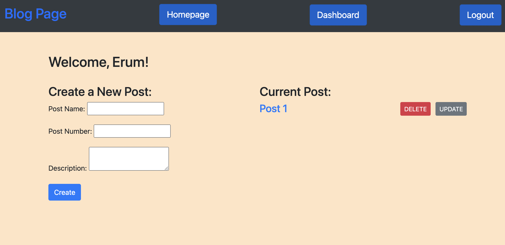

# Tech-Blog

## Description
Built a CMS-style blog site similar to a Wordpress site, where developers can publish their blog posts and comment on other developer's posts as well. The app follows the MVC paradigm in its architectural structure, using Handlebars.js as the templating language, Sequelize as the ORM, and the express-session npm package for authentication.

## Table of Contents
- [Installation](#installation/usage)
- [Deployment](#deployment)
- [Questions](#questions)
- [Contribution](#contribution)
- [License](#license)

## Installation/Usage

1. After cloning repo to your device in terminal run "npm install"
2. Open up SQL Workbench and run the db files tech_blog.sql.
3. In .envEXAMPLE file set up your connection (database, username, password).
4. Rename .envEXAMPLE to ".env"
5. Open terminal and locate the folder
6. In terminal command line run "npm start"

## Deployment
https://github.com/erumd/Tech-Blog

Heroku Deployment: 
https://murmuring-savannah-04457.herokuapp.com/

## Questions

If you have any questions or would like to contribute you can view my GitHub account:
(https://github.com/erumd)
or email me erumdhukka531@gmail.com.

## Contribution
I want to thank Jasmine, Michael, and Will for their helping me with this project. 

## Reflections on Project
This was a hard project to do. This project helped me to get comfortable using the MVC model. There is still more practice i need to get comfortable. I used the mini project from class to help me with this assignment.  
## License

MIT License

Copyright (C) 2021, Erum Dhukka

Permission is hereby granted, free of charge, to any person obtaining a copy
of this software and associated documentation files (the "Software"), to deal
in the Software without restriction, including without limitation the rights
to use, copy, modify, merge, publish, distribute, sublicense, and/or sell
copies of the Software, and to permit persons to whom the Software is
furnished to do so, subject to the following conditions:

The above copyright notice and this permission notice shall be included in all
copies or substantial portions of the Software.

THE SOFTWARE IS PROVIDED "AS IS", WITHOUT WARRANTY OF ANY KIND, EXPRESS OR
IMPLIED, INCLUDING BUT NOT LIMITED TO THE WARRANTIES OF MERCHANTABILITY,
FITNESS FOR A PARTICULAR PURPOSE AND NONINFRINGEMENT. IN NO EVENT SHALL THE
AUTHORS OR COPYRIGHT HOLDERS BE LIABLE FOR ANY CLAIM, DAMAGES OR OTHER
LIABILITY, WHETHER IN AN ACTION OF CONTRACT, TORT OR OTHERWISE, ARISING FROM,
OUT OF OR IN CONNECTION WITH THE SOFTWARE OR THE USE OR OTHER DEALINGS IN THE
SOFTWARE.
